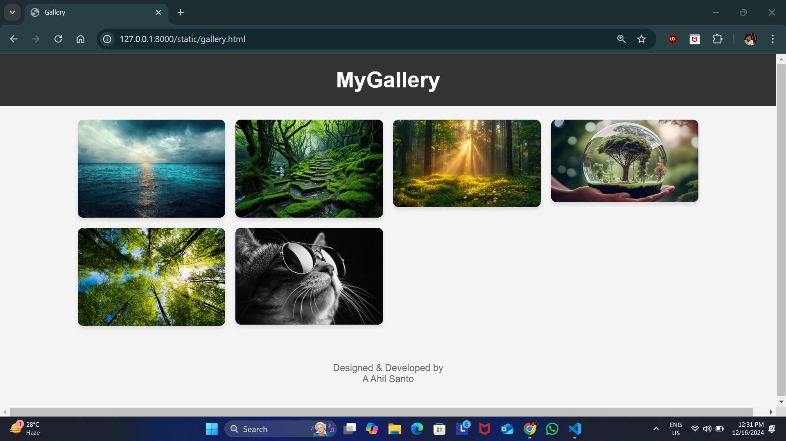
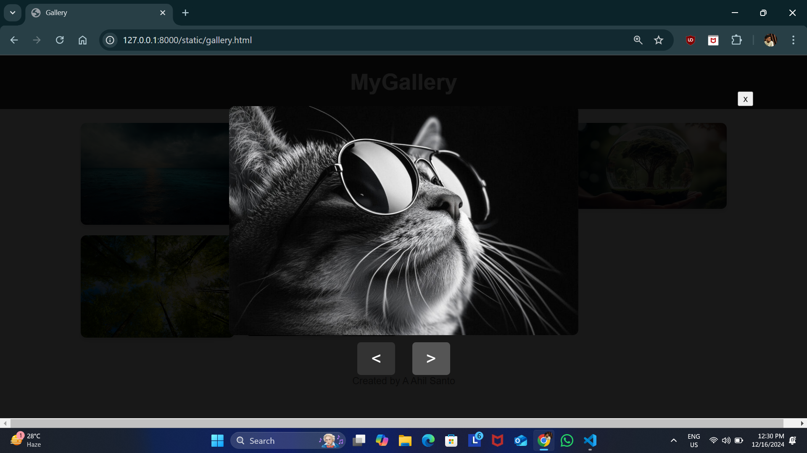
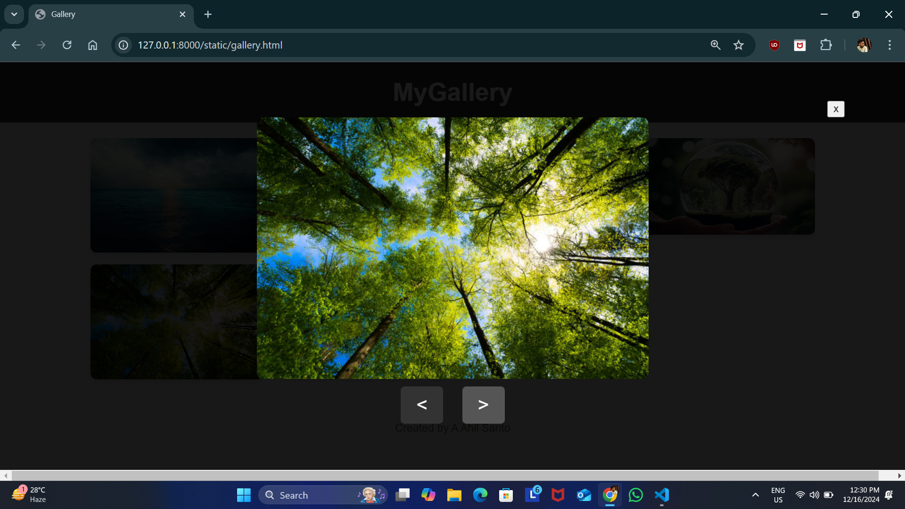

# Ex.08 Design of Interactive Image Gallery
## Date:16.12.24

## AIM:
To design a web application for an inteactive image gallery with minimum five images.

## DESIGN STEPS:

### Step 1:
Clone the github repository and create Django admin interface.

### Step 2:
Change settings.py file to allow request from all hosts.

### Step 3:
Use CSS for positioning and styling.

### Step 4:
Write JavaScript program for implementing interactivity.

### Step 5:
Validate the HTML and CSS code.

### Step 6:
Publish the website in the given URL.

## PROGRAM :

```
gallery.html

<!DOCTYPE html>
<html lang="en">
<head>
    <meta charset="UTF-8">
    <meta name="viewport" content="width=device-width, initial-scale=1.0">
    <title>Gallery</title>
    <link rel="stylesheet" href="style.css">
</head>
<body>
    <header>
        <h1>MyGallery</h1>
    </header>
    <main class="gallery">
        
        
        
        
        
        
    </main>

    <div class="lightbox" id="lightbox">
        <div class="pos">
            <button id="cb" class="close">x</button>
        </div>
        
        <div class="position">
            <button id="prevBtn" class="nav-button">&lt;</button>
            <button id="nextBtn" class="nav-button">&gt;</button>
        </div>
    </div>

    <footer>
        <p>Designed & Developed by<br> A Ahil Santo</p>
    </footer>

    <script src="scripts.js"></script>
</body>
</html>

style.css

body {
    margin: 0;
    padding: 0;
    font-family: Arial, sans-serif;
    background-color: #f4f4f4;
    color: #333;
    display: flex;
    flex-direction: column;
    align-items: center;
}
.pos{
    width: 1000px;
   display: flex;
   flex-direction: row;
   justify-content: flex-end;

}
header {
    width: 100%;
    background-color: #333;
    color: #fff;
    padding: 20px;
    text-align: center;
}

header h1 {
    margin: 0;
}

.gallery {
    display: grid;
    grid-template-columns: repeat(auto-fit, minmax(200px, 1fr));
    gap: 15px;
    width: 80%;
    margin: 20px auto;
}

.gallery img {
    width: 100%;
    height: auto;
    border-radius: 8px;
    
    transition: transform 0.3s;
    box-shadow: 0 4px 6px rgba(0, 0, 0, 0.1);
}


.lightbox {
    display: none;
    position: fixed;
    top: 0;
    left: 0;
    width: 100%;
    height: 100%;
    background: rgba(0, 0, 0, 0.9);
    justify-content: center;
    align-items: center;
    z-index: 1000;
    flex-direction: column;
}

.lightbox img {
    width: 500px;
    height: auto;
    border-radius: 8px;
}

.lightbox.active {
    display: flex;
}


.nav-button {
    background: #333;
    color: #fff;
    border: none;
    font-size: 24px;
    padding: 10px 20px;
    margin: 10px;
    cursor: pointer;
    border-radius: 5px;
}

.nav-button:hover {
    background: #555;
}


footer {
    margin: 20px 0;
    text-align: center;
    font-size: 14px;
    color: #666;
}

scripts.js

const galleryImages = document.querySelectorAll('.gallery-image');
const lightbox = document.getElementById('lightbox');
const lightboxImg = document.getElementById('lightboxImg');
const prevBtn = document.getElementById('prevBtn');
const nextBtn = document.getElementById('nextBtn');

let currentIndex = 0;


function openLightbox(index) {
    lightbox.classList.add('active');
    lightboxImg.src = galleryImages[index].src;
    currentIndex = index;
}

galleryImages.forEach(function (image, index) {
    image.addEventListener('click', function () {
        openLightbox(index);
    });
});


function navigateLeft() {
    currentIndex = (currentIndex - 1 + galleryImages.length) % galleryImages.length;
    lightboxImg.src = galleryImages[currentIndex].src;
}
function close(){
    lightbox.classList.remove('active');
}
cb.addEventListener('click', function () {
    close();
});
prevBtn.addEventListener('click', function () {
    navigateLeft();
});

function navigateRight() {
    currentIndex = (currentIndex + 1) % galleryImages.length;
    lightboxImg.src = galleryImages[currentIndex].src;
}

nextBtn.addEventListener('click', function () {
    navigateRight();
});

```

## OUTPUT:







## RESULT:

The program for designing an interactive image gallery using HTML, CSS and JavaScript is executed successfully.
